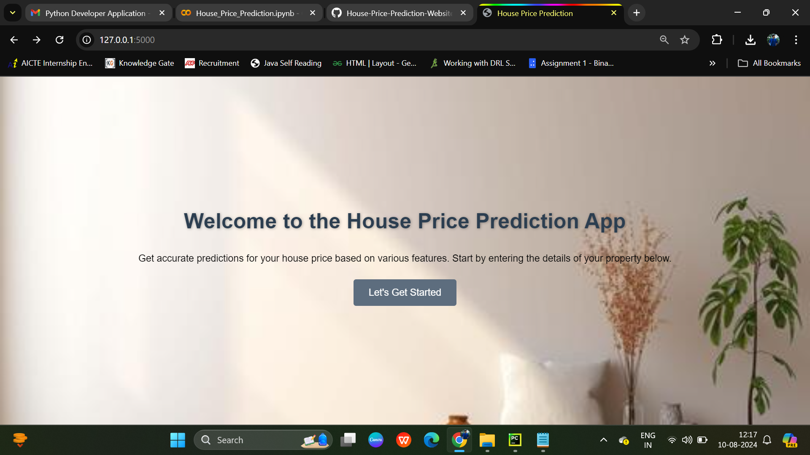
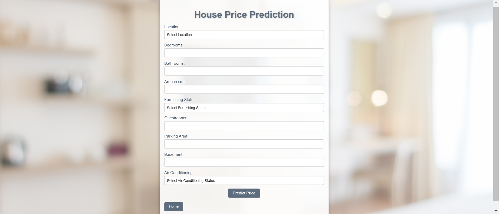
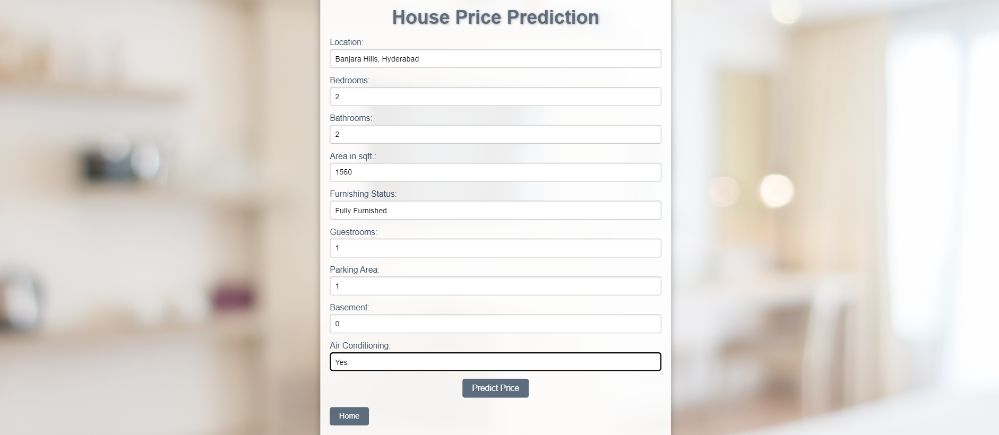

# House Price Prediction

A web application that predicts house prices based on various features using a trained machine learning model. The project is built with Python and Flask, utilizing a Random Forest Regressor for predictions.

## Table of Contents
- [Introduction](#introduction)
- [Features](#features)
- [Tech Stack](#tech-stack)
- [Setup Instructions](#setup-instructions)
- [Usage](#usage)
- [Snapshots](#snapshots)
- [Acknowledgment](#acknowledgment)

## Introduction

This project is designed to help users estimate the price of a house based on inputs such as location, number of bedrooms, bathrooms, area in square feet, furnishing status, and more. The backend uses a machine learning model trained on a dataset of house prices, and the web interface allows users to easily input their data and receive a predicted price.

## Features

- Predict house prices based on user input.
- User-friendly interface with a clean design.
- Provides accurate results using a Random Forest Regressor model.
- Option to select various features such as location, number of bedrooms, bathrooms, and more.

## Tech Stack

- **Python**: Backend logic and machine learning model.
- **Flask**: Web framework for creating the application.
- **HTML/CSS**: Frontend for the user interface.
- **Pandas**: Data manipulation and processing.
- **Scikit-Learn**: Machine learning model and preprocessing.

## Setup Instructions

1. **Clone the Repository:**
    ```bash
    git clone https://github.com/your-username/house-price-prediction.git
    ```
2. **Navigate to the Project Directory:**
    ```bash
    cd house-price-prediction
    ```
3. **Install Dependencies:**
    ```bash
    pip install -r requirements.txt
    ```
4. **Run the Application:**
    ```bash
    python app.py
    ```
5. **Access the Application:**
    - Open your browser and go to `http://127.0.0.1:5000/`.

## Usage

To use the House Price Prediction web application, follow these steps:

1. **Clone the Repository:**
    - Begin by cloning the repository to your local machine:
    ```bash
    git clone https://github.com/your-username/house-price-prediction.git
    ```

2. **Navigate to the Project Directory:**
    - Move into the project's directory:
    ```bash
    cd house-price-prediction
    ```

3. **Install the Required Dependencies:**
    - Ensure all the necessary Python packages are installed using the `requirements.txt` file:
    ```bash
    pip install -r requirements.txt
    ```

4. **Start the Flask Application:**
    - Run the Flask application to start the web server:
    ```bash
    python app.py
    ```

5. **Access the Application:**
    - Open your web browser and navigate to:
    ```plaintext
    http://127.0.0.1:5000/
    ```

6. **Using the Application:**
    - **Cover Page:** You'll start on the cover page. Click the "Let's Get Started" button to proceed to the main page.
    - **Main Page:** 
        - Enter the details of your property, such as location, number of bedrooms, bathrooms, area in square feet, furnishing status, etc.
        - Click the "Predict Price" button to generate the estimated house price.
    - **View Prediction:** The predicted house price will be displayed on the main page in Indian Rupees.

7. **Shut Down the Application:**
    - To stop the Flask server, return to your terminal and press `Ctrl+C`.

8. **(Optional) Customize the Project:**
    - Feel free to modify the HTML, CSS, and Python code to better suit your needs. You can also retrain the model with new data if desired.

## Snapshots

### Cover Page


### Main Page


### User-Input-Values-Page


### Prediction Result


## Acknowledgment

I would like to express my sincere thanks to all the open-source contributors and the developers behind the libraries and tools used in this project, including:

- [Flask](https://flask.palletsprojects.com/)
- [Scikit-Learn](https://scikit-learn.org/)
- [Pandas](https://pandas.pydata.org/)


Special thanks to my mentors, peers, and the open-source community for their continuous support and contributions. Your insights and feedback have been invaluable in the completion of this project.

---

Thank you for using the House Price Prediction app! If you have any questions, feel free to reach out or submit an issue in the repository.
